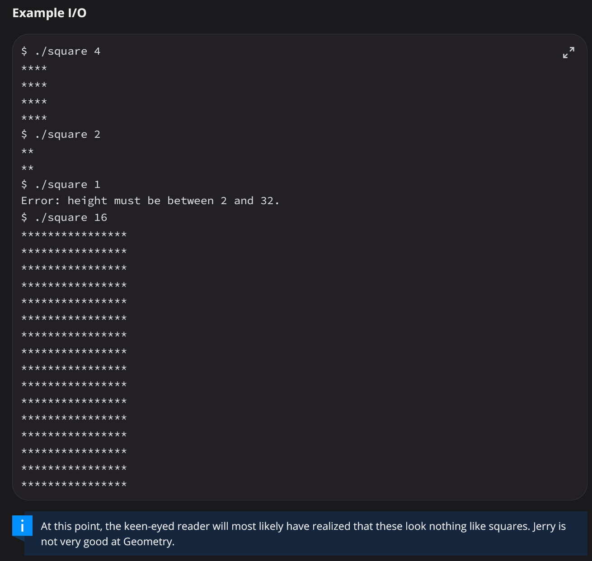

# PA History

{: .note}
I've never been on PA team so this might not be perfectly accurate but I think it's close.

1. Before CSE 29 existed, there was only CSE30. When Gerald taught CSE30 in [Winter 2023](https://cse30winter2023.github.io/) it inspired 29 which would begin with the same TA, Jerry Yu.

1. CSE 30 had things such as this  scattered around the PA writeups and I thought they were hilarious.
1. [Spring 2024](https://cse29sp24.github.io/docs/pas/pa1.html) was written by Jerry Yu and team.
Chernova, Anya
Kave, Joshua
Modi, Arnav
Shi, Steven
1. [Fall 2024](https://ucsd-cse29.github.io/fa24/pa/pa3/index.html) appears to be missing it's first 2 PAs but not to worry they are about the same as FA25, no idea who wrote these.
1. Winter 2025 was based on SP24 loosely.
1. [Spring 2025](https://cse29spring2025.github.io/pa1) revamped SP24 using a bit of WI25 by Michael Peng and team Anya Chernova, Kyle Trinh, and Harsha Kavuri
1. Summer we don't talk about.
1. FA 25 was FA24 again
1. WI 26 was FA25 again
1. SP26 was SP25 again